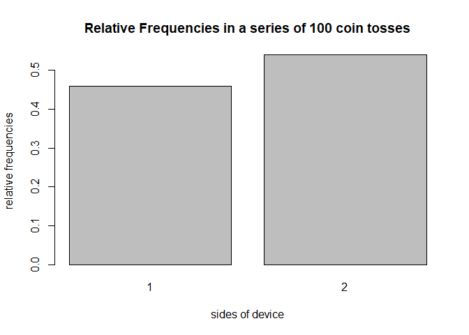

<!-- README.md is generated from README.Rmd. Please edit that file -->
Overview
--------

`"roller"` is a minimal [R](http://www.r-project.org/) package that provides functions to simulate the rolling of an `n` sided objet `t` times. This package is perfect for simple statistical modeling of any named `n` sided object.

-   `device()` creates a coin object (of class `"device"`)
-   `roll()` tosses a coin object, producing a `"roll"` object.
-   `plot()` method for a `"roll"` object to plot frequencies of heads.
-   `summary()` method for a `"roll"` object (of class `"summary.rolls"`)

Motivation
----------

This package was developed further build my personal package building skills. Thanks to [Gaston Sanchez](http://www.gastonsanchez.com/) for the code inspiration, which can be found [here](https://github.com/gastonstat/cointoss). This package is an addition/similar implimentation to the package he made.

Usage Example
-------------

``` r

library(roller)
# default
basic_device <- device()
basic_device
#> object "device"
#> 
#>   sides prob
#> 1     1  0.5
#> 2     2  0.5

# one roll
roll1 <- roll(device = basic_device)
roll1
#> object "rolls"
#> 
#> $rolls
#> [1] 2

# multiple Roll
roll100 <- roll(device = basic_device, times = 100)

# summarizing the roll
summary(roll100)
#> summary "rolls"
#> 
#>   side count prop
#> 1    1    46 0.46
#> 2    2    54 0.54

# plot the multiple rolls
plot(roll100)
```


